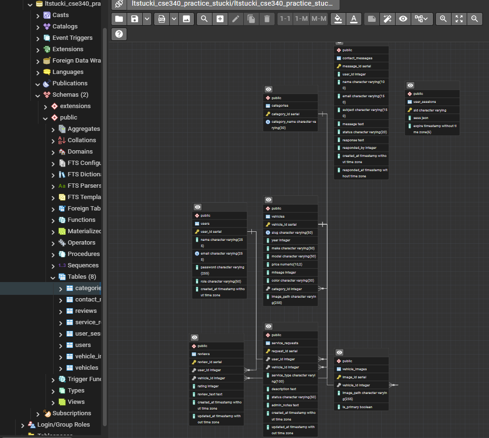

# Used Car Dealership Web Application

## Project Description

This is a full-stack used car dealership web application built using Node.js, Express, EJS, and PostgreSQL. The application allows users to browse available vehicles, leave reviews, submit service requests, and contact the dealership.

The system includes role-based access control where employees and owners can manage inventory, users, and customer interactions through an admin dashboard.

---

## Live Deployment

[👉 Add your Render URL here]

Example:
https://your-app-name.onrender.com

---

## Technology Stack

* Node.js
* Express.js
* EJS (server-side rendering)
* PostgreSQL
* express-session (authentication)
* bcrypt (password hashing)

---

## Database Schema (ERD)

 Replace this with screenshot



---

## User Roles

### Owner

* Full access to the system
* Manage vehicles, categories, users
* View and respond to contact messages
* Manage service requests

### Employee

* Manage vehicles
* View and update service requests
* Respond to contact messages

### Standard User

* Browse vehicles
* Leave reviews
* Submit service requests
* Contact dealership
* View their own messages and requests

---

## Core Features

### Vehicle System

* Browse vehicles by category
* View individual vehicle details
* Admin can add, edit, and delete vehicles

### Reviews

* Users can leave reviews on vehicles
* Users can edit/delete their own reviews
* Admin can moderate reviews

### Service Requests (Workflow System)

* Users submit service requests
* Requests move through stages:

  * Submitted
  * In Progress
  * Completed
* Admin can update status and add notes

### Contact System

* Guests and users can submit contact messages
* Admin can view all messages
* Admin can respond to messages
* Messages update status (open → closed)

### Admin Dashboard

* Central control panel for:

  * Vehicles
  * Users
  * Service requests
  * Contact messages

---

## Test Accounts

Use the following accounts to test functionality:

**Owner**

* Email: [owner@test.com](mailto:owner@test.com)
* Password: P@$$w0rd!

**Employee**

* Email: [employee@test.com](mailto:employee@test.com)
* Password: P@$$w0rd!

**User**

* Email: [user@test.com](mailto:user@test.com)
* Password: P@$$w0rd!

---

## Screenshots

### Home Page


### Vehicle Detail Page


### Admin Dashboard


### Contact Messages (Admin View)


### Service Requests


---

## Known Limitations

* UI styling could be improved for mobile responsiveness
* No email notifications for contact responses
* Some validation could be expanded further

---

## Setup Instructions (Local Development)

1. Clone the repository
2. Install dependencies:

   ```
   npm install
   ```
3. Create a `.env` file with:

   ```
   DB_URL=your_postgres_connection
   SESSION_SECRET=your_secret
   ```
4. Run the server:

   ```
   npm run dev
   ```

---

## Author

Landon Stucki

---
